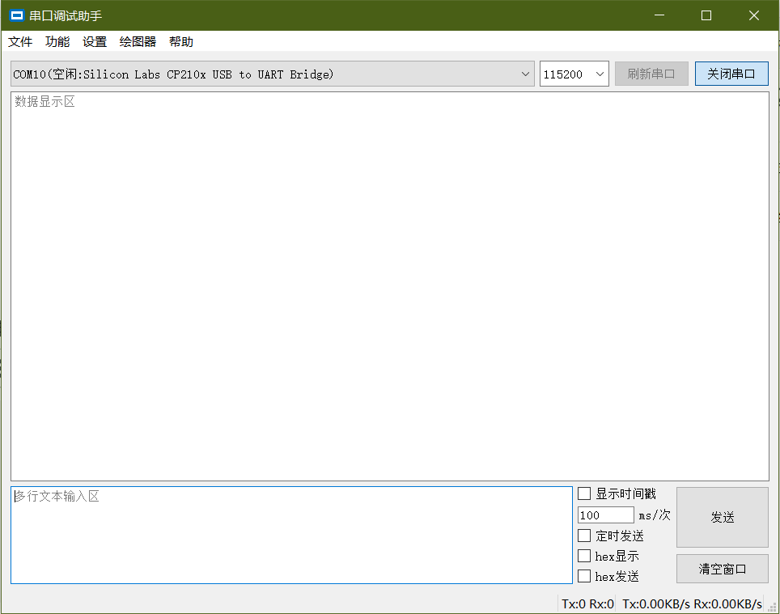
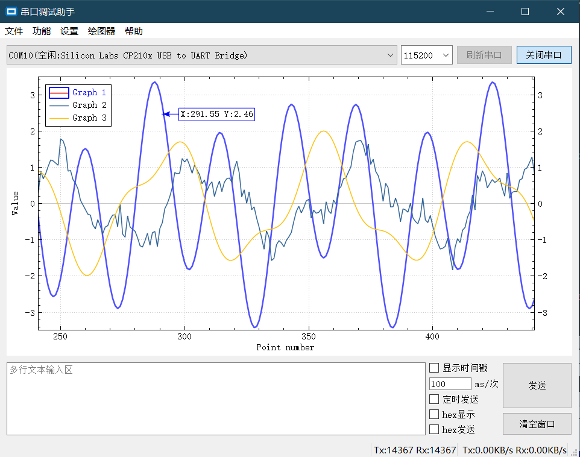
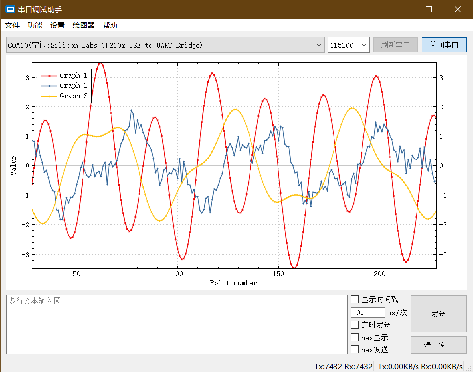

# QT串口调试助手
  一个基于QT的串口调试助手，实现了基本收发功能、绘图功能、数据保存、关键字高亮等功能，并支持STM32F1和F4系列的自动下载。

# 已知问题
  - 代码重构/优化/注释

# 拟增功能
  - 多语言支持。
  - 图像Y轴只按显示的区域最大值调整
  - 大量数据可能卡顿的问题
  - 字体修改？
  - 自动滚屏开关？
  - 串口热插拔检测。

# 临时记录
  - 绘图器转码时由utf8改为local8bit
  - 两个逗号，用0表示。
  - 正则规则再完善
  - 卡顿
  - YModen协议支持