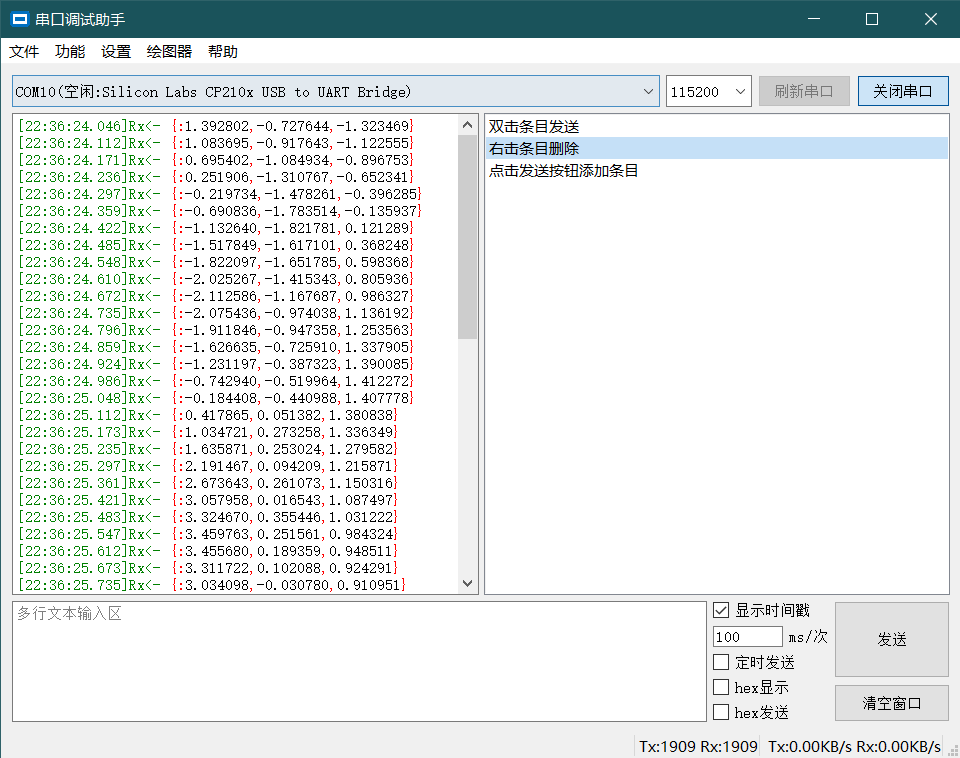

# QT串口调试助手
  一个基于QT的串口调试助手，实现了基本收发功能、绘图功能、数据保存、关键字高亮等功能，并支持STM32F1和F4系列的自动下载。

绘图协议：

```c
//几条曲线就几个变量。
printf("{:%f,%f}\r\n", data1, data2);
```




# 已知问题
  - 代码重构/优化/注释

# 拟增功能
  - 多语言支持。
  - 图像Y轴只按显示的区域最大值调整
  - 自动滚屏开关？
  - 串口热插拔检测。
  - 测试stm32a07版本是否正常
  - ISP Tool测试自动下载电路 -ADC

# 临时记录
  - XYZModen协议支持?